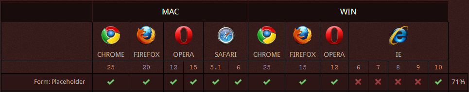

# jQuery placeholder

基于jQuery实现的针对IE6~9表单placeholder属性的兼容处理

## 需求

在HTML5中，文本输入框新增了一个名为“placeholder”的属性。它的作用是为文本框或者文本域提供占位文本的显示，在用户没有输入任何文本内容的情况下显示一些提示信息，促进用户对文本框的理解。

placeholder属性在各浏览器的兼容情况如下图所示：



从上图我们看到，除了IE6-9之外，其他厂商的浏览器以及IE10+都已经支持placeholder属性。由于在网站项目中，我们会经常使用到占位为本这项服务，又考虑到IE6~9的市场情况——截止2014年11月30日，这部分用户约占47%（来自[百度流量研究院](http://tongji.baidu.com/data/browser/)），因此我们有必要开发这款基于jQuery实现的针对IE6~9浏览器表单placeholder属性的兼容处理插件来满足项目需求。

## 使用

首先，我们如同高级浏览器那般为表单元素添加 `placeholder` 属性：

```html
<div><input id="frmName" placeholder="您的姓名" /></div>
<div><textarea id="frmIntro" placeholder="自我介绍"></textarea></div>
```

然后，为这些元素执行 `.placeholder()` 函数调用：

```js
$("input[placeholder], textarea[placeholder]").placeholder();
```

这样，我们就完成了对IE6~9浏览器表单placeholder属性的兼容处理。

你可以点击下面的链接来查看placeholder属性在所有浏览器里面的兼容情况：

1. [Chrome、Firefox行为模拟](//htmlpreview.github.io/?https://github.com/springlong/jquery-placeholder/blob/master/demo/demo.html)
2. [IE10+行为模拟](//htmlpreview.github.io/?https://github.com/springlong/jquery-placeholder/blob/master/demo/demo-2.html)


## 表现

1、我们通过在表单元素前面插入`<ins>`标签来进行占位文本的输出，通过对该标签进行定位来模拟占位文本的样式表现。

2、默认情况下，我们模拟Chrome、Firefox浏览器中占位文本的行为方式：当文本框获得焦点时并不隐藏占位文本的显示，仅当输入内容后方才隐去。如果文本框从存在内容的情况下转变到置空的情况，那么占位文本将再次显示。

3、可以在执行 `.placeholder()` 函数调用之前对 `$.placeholderHideFocus` 属性赋值为 `true` 来改变全局的模拟行为——从而模拟IE10+的行为方式：当文本框获得焦点时隐藏占位文本的显示，失去焦点时且文本内容为空的情况下恢复占位文本的显示。

```js
//设置全局行为：获得焦点时隐藏占位显示
$.placeholderHideFocus = true;
```

4、除了设置全局的变更行为外，我们还可以通过设置表单元素的 `data-placeholder-hidefocus` 属性为 `true` 或 `false` 来改变当前元素的私有行为。

```html
<!--设置私有行为：获得焦点时隐藏占位显示-->
<div><input id="frmName" placeholder="您的姓名" data-placeholder-hidefocus="true" /></div>
```

5、默认情况下，模拟出来的占位文本的颜色值为 `#c1c1c1` , 为了满足多变的需求，我们提供了 `$.placeholderColor` 属性来设置全局的占位文本的颜色。

```js
//设置全局的占位文本颜色：#999
$.placeholderColor = "#999";
```

6、除了设置全局的占位文本的颜色值外，我们还可以通过设置表单元素的 `data-placeholder-color` 属性来改变当前元素私有的占位文本的颜色值。

```html
<!--设置私有的占位文本颜色：#999-->
<div><input id="frmName" placeholder="您的姓名" data-placeholder-color="#999" /></div>
```

7、当我们通过jQuery的 `.attr()` 函数来设置表单元素的 `placeholder` 属性时，将会自动变更模拟的占位文本的内容。

8、当我们通过jQuery的 `.val()` 函数来设置表单元素的值时，也将自动变更模拟的占位文本的显示状态。 

## 注意事项

1. 为了保证模拟的占位文本的值和状态能够及时更新，请确保使用jQuery提供的`.attr()`函数来修改表单元素的`placeholder`属性，使用`.val()`函数来修改表单元素的值。

2. 由于我们是通过插入新的元素来模拟占位文本的展现，因此进行占位模拟的表单元素必须是静态定位，否则无法将模拟的占位文本正确地定位到表单元素的上方。

3. 允许表单元素设置字体、文本、盒模型的所有属性，但是`margin-left`属性的值必须是固定值不能设置为auto，因为低版本IE浏览器中无法获取值为auto的正确边距。
